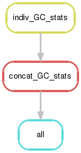

# Assess GC-associated coverage biases

Pipeline overview:



## Visualize GC results

Visualize proportion of copy 2 regions called correctly across all samples using
the summary data.

```bash
Rscript scripts/plot_GC_summary.R combined_output/wssd_GC_cp.summary combined_output/wssd_GC_cp.summary.pdf
```

Visualize the proportion of copy 2 regions called correctly by GC window and
sample with one line per sample.

```bash
Rscript scripts/plot_GC.R combined_output/wssd_GC_cp.dataframe combined_output/wssd_GC_cp.dataframe.pdf
```
